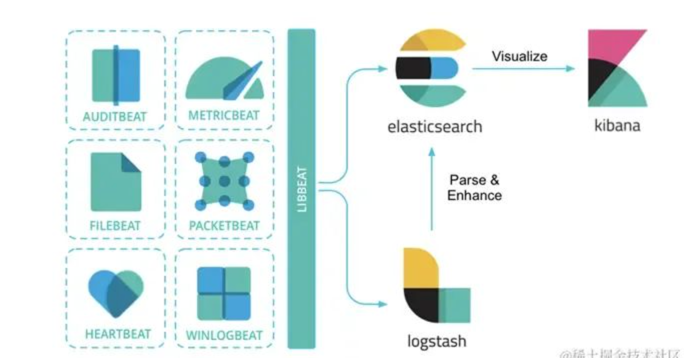
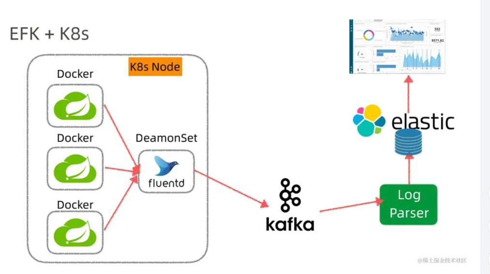

## 优势
高性能：Elasticsearch具有快速的搜索和分析能力，能够处理大规模的数据。

可扩展性：Elasticsearch可以轻松地扩展到多个节点，以处理大量的数据和请求。

实时性：Elasticsearch能够实时地索引和搜索数据，使得用户可以快速获取最新的信息。

## 应用

分布式搜索引擎

#### 日志分析

ELK 是 Elasticsearch、Logstash 和 Kibana 的第一个字母组合，也叫 ELK Stack。是一套用于数据采集、存储、分析和可视化的开源工具集。

Beats负责日志的采集

Logstash负责做日志的聚合和处理

ES作为日志的存储和搜索系统

Kibana作为可视化前端展示

EFK

PLG V.S ELK
Grafana，开源的可视化和分析软件，允许用户查询、可视化、警告和探索监控指标。Grafana主要提供时间序列数据的仪表板解决方案，支持超过数十种数据源。

Grafana Loki是一组可以组成一个功能齐全的日志堆栈组件，与其它日志系统不同，Loki只建立日志标签的索引而不索引原始日志消息，而是为日志数据设置一组标签，即Loki运营成本更低，效率还提高几个数量级

Loki日志带有一组标签名和值，只有标签对被索引，这种权衡使它比完整索引操作成本更低

## 分片
