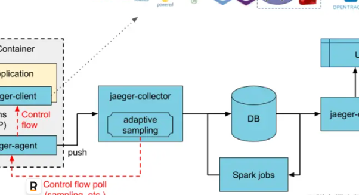

## OpenTracing 是一个链路追踪的规范

一条Trace（调用链）可以被认为是一个由多个Span组成的有向无环图（DAG图）， Span与Span的关系被命名为References。

只要是一个具有完整时间周期的程序访问，都可以被认为是一个span， 出入度

## Span内容
每个Span包含以下的状态:（译者注：由于这些状态会反映在OpenTracing API中，所以会保留部分英文说明）

An operation name，操作名称
A start timestamp，起始时间
A finish timestamp，结束时间

Span Tag，一组键值对构成的Span标签集合。键值对中，键必须为string，值可以是字符串，布尔，或者数字类型。

Span Log，一组span的日志集合。 每次log操作包含一个键值对，以及一个时间戳。 键值对中，键必须为string，值可以是任意类型。
但是需要注意，不是所有的支持OpenTracing的Tracer,都需要支持所有的值类型。

SpanContext，Span上下文对象 (下面会详细说明)

References(Span间关系)，相关的零个或者多个Span（Span间通过SpanContext建立这种关系）

每一个SpanContext包含以下状态：

任何一个OpenTracing的实现，都需要将当前调用链的状态（例如：trace和span的id），依赖一个独特的Span去跨进程边界传输

Baggage Items ，Trace的随行数据，是一个键值对集合，它存在于trace中，也需要跨进程边界传输

## Span之间的关系
ChildOf 引用: 一个span可能是一个父级span的孩子，即”ChildOf”关系。在”ChildOf”引用关系下，父级span某种程度上取决于子span。下面这些情况会构成”ChildOf”关系：

一个RPC调用的服务端的span，和RPC服务客户端的span构成ChildOf关系
一个sql insert操作的span，和ORM的save方法的span构成ChildOf关系

很多span可以并行工作（或者分布式工作）都可能是一个父级的span的子项，他会合并所有子span的执行结果，并在指定期限内返回
引用: 一些父级节点不以任何方式依赖他们子节点的执行结果，这种情况下，我们说这些子span和父span之间是”FollowsFrom”的因果关系。
”FollowsFrom”关系可以被分为很多不同的子类型，未来版本的OpenTracing中将正式的区分这些类型

具体实现

func JaegerGatewayMiddleware(tracer opentracing.Tracer) gin.HandlerFunc {
    return func(ctx *gin.Context) {
        var md = make(metadata.Metadata, 1)
        opName := ctx.Request.URL.Path + "-" + ctx.Request.Method // 操作名称
        parentSpan := tracer.StartSpan(opName)
        defer parentSpan.Finish()
        injectErr := tracer.Inject(parentSpan.Context(), opentracing.TextMap, opentracing.TextMapCarrier(md)) // 将TraceID注入到md中
        if injectErr != nil {
            logger.Fatalf("%s: Couldn't inject metadata", injectErr)
        }
        newCtx := metadata.NewContext(ctx.Request.Context(), md) // 利用context传递TraceID
        ctx.Request = ctx.Request.WithContext(newCtx)
        ctx.Next()
    }
}

### 各个RPC服务链接
直接调用go-micro提供的链路追踪plugins
arduino 代码解读复制代码import opentracingplugins "github.com/go-micro/plugins/v4/wrapper/trace/opentracing"
micro.WrapHandler(opentracingplugins.NewHandlerWrapper(tracer)),

内部主要实现, 先找提取父级Span的TraceID，启动本层的Span并携带这个TraceID，利用context传递下去。

var Tracer opentracing.Tracer
