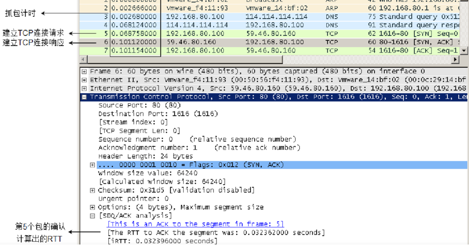

参考连接：https://www.jianshu.com/p/29e0ba31fb8d

# HTTPS（1.2）

### 预备知识

HTTPS ： 由 HTTP 加上 TLS/SSL 协议构建的可进行加密传输、身份认证的网络协议，主要通过数字证书、加密算法、非对称密钥等技术完成互联网数据传输加密，实现互联网传输安全保护。

TLS： IETF将SSL进行标准化，1999年公布第一版TLS标准文件,TLS协议的优势是与高层的应用层协议（如HTTP、FTP、Telnet等）无耦合。

## HTTPS 交互概览

3RTT 时间

第一次握手：客户端发送syn包(syn=j)到服务器，并进入SYN_SEND状态，等待服务器确认；

第二次握手：服务器收到syn包，必须确认客户的SYN（ack=j+1），同时自己也发送一个SYN包（syn=k），即SYN+ACK包，此时服务器进入SYN_RECV状态；

第三次握手：客户端收到服务器的SYN＋ACK包，向服务器发送确认包ACK(ack=k+1)，此包发送完毕，客户端和服务器进入ESTABLISHED状态，完成三次握手。

RTT计算

## HTTPS 需要解决的三个问题

信息安全问题：1. 保证加密性。2.保证完整性。3.身份识别

### 加密性：

​    通用的方法是使用非对称加密+对称加密来完成。客户端使用公钥对对称加密的密钥进行加密，然后传递给服务端，服务端使用私钥进行解密确认密钥，开始传输数据。

- 对称加密【运算快】：

​      双方持有相同的密钥进行通信。 如AES，ChaCha20

​	对称加密还有分组模式，可以让算法的固定长度的密钥加密任意长度明文，形成密文，常用的有GCM、CCM

​      缺点：如何保证密钥不被破解

- 非对称加密【运算慢】：

​      公钥能解私钥，私钥能解公钥。如DH、RSA、ECC（省带宽

 、内存）

  

### 信息完整性：

​    散列算法：

​      客户端使用公钥加密的该内容的hash值与原始内容，服务端使用私钥进行解密获得原始内容和摘要值。

​    

  

###  身份识别：

​    发送将发送私钥加密好的数据，并传送公钥给接收方，接收方收到了公钥便可以解密密文，自然认证了发送方的身份。

​    存在问题： 如果传输公钥过程中，被第三方劫持并伪造一对非对称密钥，第三方拥有自己的伪造的私钥和服务端发送的公钥，作中间人劫持

   解决方案：

​    数字证书是由权威的CA（Certificate Authority）机构给服务端进行颁发，CA机构通过服务端提供的相关信息生成证书，证书内容包含了持有人的相关信息，服务器的公钥，签署者签名信息（数字签名）等。

   如何保证证书的不被中间人伪造？

  数字证书（证书内容，散列算法，加密密文）在传输过程中使用CA机构提供的私钥加密。

  浏览器中有内置CA机构证书公钥，会验证证书是否为权威机构发放，完成了身份验证。 对于服务端发来的数字证书进行证书公钥解密，解密后的密文有hash值， 解密后的证书内容和hash算法运算得到另一个hash值，比对后 一致表明证书内容是CA机构颁发的合法的证书，完成了公钥传输

  特点： 依赖权威机构的权威性。

## 建立过程：

HTTP建立

（1RTT）

1. 客户端发送SSL 版本号，加密算法种类，**客户端随机数C**。【密钥交换算法+签名算法+对称加密算法+摘要算法】

2. 服务端返回确认的SSL 版本号，支持的加密算法种类，数字证书还有**服务端随机数S和服务端的公钥SP和私钥签名**。S

1RTT

   3. 证书验证逻辑见上文 

4. 证书验证通过，客户端发送客户端公钥给服务端

此时 客户端和服务端都拥有随机数C，随机数S，还有一致的加密算法。此时两端通过密钥交换算法对各自的随机数进行加密，在随机数C、S进行PDF加密，得出主密钥

1RTT

6. 客户端使用加摘要算法对之前的内容进行摘要，并用会话公钥加密，发送给服务端

7. 之后的数据传送都使用会话密钥加密传输

​    

​    

## HTTPS 建连过程
1. 客户端发起HTTPS请求

2. 服务端的配置

采用HTTPS协议的服务器必须要有一套数字证书，可以是自己制作或者CA证书。区别就是自己颁发的证书需要客户端验证通过，才可以继续访问，而使用CA证书则不会弹出提示页面。这套证书其实就是一对公钥和私钥。公钥给别人加密使用，私钥给自己解密使用。

3. 传送证书

这个证书其实就是公钥，只是包含了很多信息，如证书的颁发机构，过期时间等。

4. 客户端解析证书

这部分工作是有客户端的TLS来完成的，首先会验证公钥是否有效，比如颁发机构，过期时间等，如果发现异常，则会弹出一个警告框，提示证书存在问题。如果证书没有问题，那么就生成一个随即值，然后用证书对该随机值进行加密。

5. 传送加密信息

这部分传送的是用证书加密后的随机值，目的就是让服务端得到这个随机值，以后客户端和服务端的通信就可以通过这个随机值来进行加密解密了。

6. 服务段解密信息

服务端用私钥解密后，得到了客户端传过来的随机值(私钥)，然后把内容通过该值进行对称加密。所谓对称加密就是，将信息和私钥通过某种算法混合在一起，这样除非知道私钥，不然无法获取内容，而正好客户端和服务端都知道这个私钥，所以只要加密算法够彪悍，私钥够复杂，数据就够安全。

7. 传输加密后的信息

这部分信息是服务段用私钥加密后的信息，可以在客户端被还原。

8. 客户端解密信息

客户端用之前生成的私钥解密服务段传过来的信息，于是获取了解密后的内容。

PS: 整个握手过程第三方即使监听到了数据，也束手无策。

## 四次挥手

第一次挥手：客户端发送一个 FIN（SEQ=x） 标志的数据包->服务端，用来关闭客户端到服务端的数据传送。然后客户端进入 FIN-WAIT-1 状态。

第二次挥手：服务端收到这个 FIN（SEQ=X） 标志的数据包，它发送一个 ACK （ACK=x+1）标志的数据包->客户端 。然后服务端进入 CLOSE-WAIT 状态，客户端进入 FIN-WAIT-2 状态。

第三次挥手：服务端发送一个 FIN (SEQ=y)标志的数据包->客户端，请求关闭连接，然后服务端进入 LAST-ACK 状态。

第四次挥手：客户端发送 ACK (ACK=y+1)标志的数据包->服务端，然后客户端进入TIME-WAIT状态，服务端在收到 ACK (ACK=y+1)标志的数据包后进入 CLOSE 状态。此时如果客户端等待 2MSL 后依然没有收到回复，就证明服务端已正常关闭，随后客户端也可以关闭连接了。只要四次挥手没有结束，客户端和服务端就可以继续传输数据！

## HTTP

Http版本升级：

> Http 1. 0 : 
>
> \1. 事务一次结束后连接关闭，默认不支持长连接（请求结束）
>
> \2. 同步阻塞问题，请求队列的第一个请求因为服务器正忙（或请求格式问题等其他原因），导致后面的请求被阻塞。（未请求）
>
> 
>
> Http1.1:
>
>   \1. 默认开启持久连接，并且允许管道化， 即客户端可以排队发送数据请求无需等待响应，但服务器端必须按照接收到客户端请求的先后顺序依次回送响应结果，以保证客户端能 够区分出每次请求的响应内容。
>
> 缺点： 如果某一个响应慢，会影响后面的响应发送（不允许响应插队）。
>
>   \2. 支持只发送头部数据。节省带宽
>
>   \3. 支持断点传输
>
>   \4. 支持host 域
>
> 
>
> Http2.0：
>
> 应用层（HTTP2.0）和传输层（TCP or UDP）之间增加一个二进制分帧层。在二进制分帧层上，HTTP2.0会将所有传输的信息分为更小的消息和帧，并采用二进制格式编码，其中HTTP1.x的首部信息会被封装到Headers帧，而Request Body则封装到Data帧
>
>   \1. 采用二进制流进行数据传输，数据被分割成多个帧，帧上有流id，每个请求代表一个流 ，所有传输的数据都会被分割
>
>   \2. 多路复用，这意味着HTTP 2.0的通信都在一个连接上完成了，这个连接可以并发承载任意数量的双向数据流，无需浏览器开启多个tcp连接（解决线头阻塞问题）
>
>   \3. 压缩消息头，开启http连接后具有消息头缓存
>
>   \4. 消息具有优先级
>
>   \5. 服务器可以主动推送数据
>
>   \6. 更安全，HTTP2.0使用了tls的拓展ALPN做为协议升级，除此之外，HTTP2.0对tls的安全性做了近一步加强，通过黑名单机制禁用了几百种不再安全的加密算法。
>
> 这种改变从根本上解决了阻塞问题，快的响应可以先返回，快的请求可以先处理，最终响应的顺序还是和请求数据时的顺序一致

## TCP调优
/proc/sys/net/ipv4/存放着TCP参数的文件,目录中的内容用来添加网络设置，在其中的许多设置，可以用来阻止对系统的攻击，或用来设置系统的路由功能

### tcp_tw_reuse
0	1	表示是否允许重新应用处于TIME-WAIT状态的socket用于新的TCP连接(这个对快速重启动某些服务,而启动后提示端口已经被使用的情形非常有帮助)

tcp_fin_timeout	60	2	对于本端断开的socket连接，TCP保持在FIN-WAIT-2状态的时间。对方可能会断开连接或一直不结束连接或不可预料的进程死亡。默认值为 60 秒

tcp_orphan_retries73在近端丢弃TCP连接之前﹐要进行多少次重试。默认值是7个﹐相当于 50秒 - 16分钟﹐视 RTO 而定。如果您的系统是负载很大的web服务器﹐那么也许需要降低该值,这类 sockets 可能会耗费大量的资源。另外参的考tcp_max_orphans

tcp_keepalive_intvl	74	15	探测消息未获得响应时，重发该消息的间隔时间（秒）。默认值为75秒。 (对于普通应用来说,这个值有一些偏大,可以根据需要改小.特别是web类服务器需要改小该值,15是个比较合适的值)

tcp_synack_retries51对于远端的连接请求SYN，内核会发送SYN+ACK数据包，以确认收到上一个SYN连接请求包。这是所谓的三次握手机制的第二个步骤。这里决定内核再放弃之前所发送出的SYN+ACK数目。不应该大于255，默认值是5，对应于180秒左右时间。

tcpsyn_retries51对于一个新建连接，内核要发送多少个SYN连接请求才决定放弃。不应该大于255,默认值是5，对应于180毫秒左右时间。（对于大负载而物理通信良好的网络来说，这个值偏高，可以修改为2。这个值仅仅是针对对外的连接，对进来的连接，是由tcp_retries1决定）

tcp_window_scaling11该文件表示设置tcp/ip会话的滑动窗口大小是否可变。参数值为布尔值，为1时表示可变，为0时表示不可变。tcp/ip通常使用的窗口最大可达到65535字节，对于高速网络，该值可能太小，这时候如果启用了该功能，可以使tcp/ip滑动窗口大小增大数个数量级，从而提高数据传输的能力(RFC 1323)。

tcp_max_syn_backlog 伪造虚假源IP地址发送大量TCP-SYN半打开连接到目标系统，最终导致目标系统Socket队列资源耗尽而无法接受新的连接。